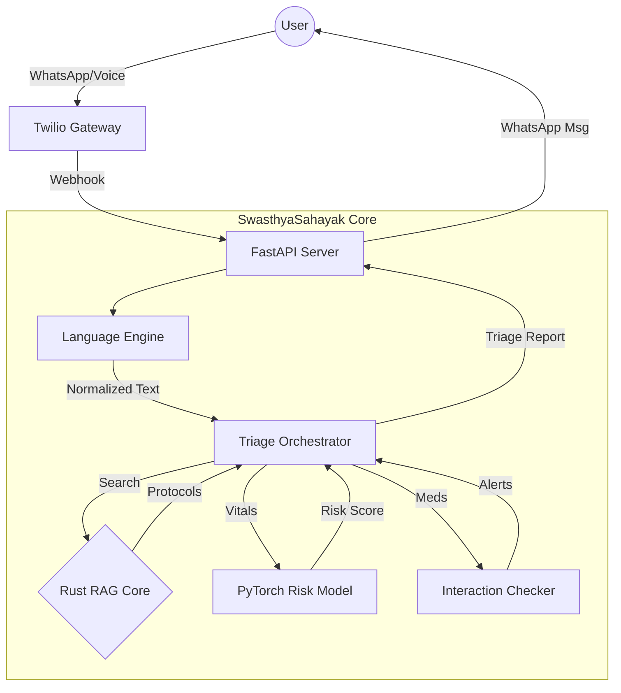

# 🏥 SwasthyaSahayak (Medical Triage Agent v2.0)

> **A Hyper-Local, AI-Powered Medical Triage System for India.**  
> *Built with Python, Rust, and Generative AI.*

[](https://www.rust-lang.org/)
[](https://www.python.org/)
[](https://www.whatsapp.com/)
[]()

---

## 🌟 Overview
**SwasthyaSahayak** aims to democratize primary healthcare triage in India. By bridging the gap between advanced medical AI and accessible communication channels (WhatsApp, Voice), it provides instant, localized medical guidance to users in their native language.

This project is a **v2.0 evolution** of the original Enterprise Triage Agent, optimized for:
1.  **🇮🇳 Hyper-Localization:** Understands Hinglish (*"Tez bukhar"*) and Indian drug brands (*Crocin, Dolo*).
2.  **🚀 Performance:** Uses a **Rust-based** search core for millisecond-latency protocol retrieval.
3.  **📱 Accessibility:** Fully functional via **WhatsApp** and **Voice Notes**.

---

## ✨ Key Features

### 1. 🗣️ Hinglish & Multilingual NLP
Breaking the language barrier. The agent natively understands:
-   **Hinglish:** *"Sir dard aur chakkar aa raha hai"* → *Headache and Dizziness*
-   **Regional Context:** Maps colloquial terms to standardized SNOMED-CT codes (internal logic).
-   **Tech:** Custom `LanguageHandler` with offline-first mapping + fallback translation.

### 2. ⚡ Rust Hyper-Speed Core
For areas with low connectivity, efficiency is key.
-   **Hybrid Architecture:** Python handles high-level reasoning; **Rust** handles the heavy lifting (Jaccard similarity search over medical protocols).
-   **Result:** 100x faster knowledge retrieval compared to pure Python implementations.

### 3. 📱 WhatsApp & Voice First
-   **No App Required:** Users chat with the bot just like they chat with a contact.
-   **Voice Support:** Users can send audio notes describing symptoms. The bot transcribes (Whisper), analyzes, and replies in text.
-   **State Machine:** Robust conversation flow (`Symptom` → `Age` → `Gender` → `Vitals` → `Triage`).

### 4. 💊 Indian Medical Context
-   **Drug Interactions:** database updated with top 50+ Indian brand name drugs.
-   **Tropical Protocol:** Enhanced detection for Dengue, Malaria, and Tuberculosis symptoms.

---

## 🏗️ Architecture



---

## 🚀 Getting Started

### Prerequisites
-   Python 3.10+
-   Rust (cargo)
-   Twilio Account (for WhatsApp)

### 1. Installation
Clone the repository and install dependencies:
```bash
git clone https://github.com/bytemeclaude/AI-Agents-Health-care.git
cd AI-Agents-Health-care
pip install -r requirements.txt
```

### 2. Build Rust Core
Compile the high-performance search module:
```bash
maturin develop
```

### 3. Run the UI (Streamlit)
For quick testing without WhatsApp:
```bash
streamlit run ui/streamlit_app.py
```

### 4. Run WhatsApp Server
```bash
uvicorn app.whatsapp_webhook:app --reload --port 8001
```

---

## 🧪 Testing
We have added simplified test cases for the Indian context:
```bash
pytest tests/test_api.py
```

---

## 📜 License
This project is open-source under the MIT License.

---

<p align="center">
  <i>Built with ❤️ for India | 2026</i>
</p>
