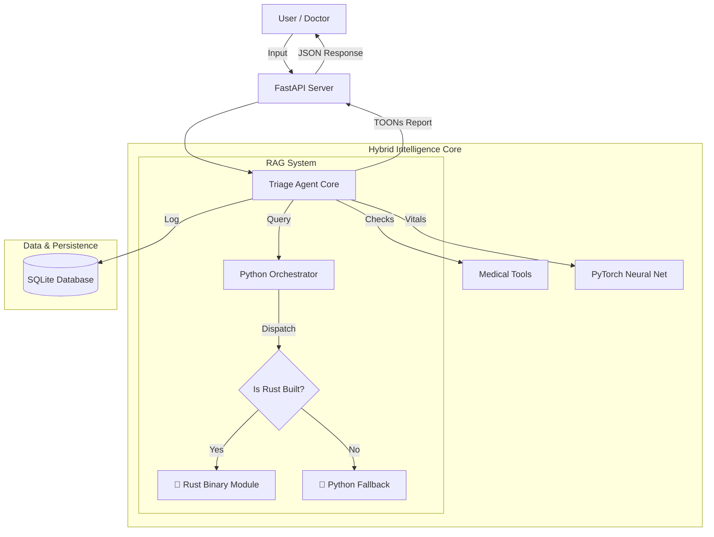

# 🏥 Medical Triage Agent (Enterprise v3.0)

> **A High-Performance, AI-Powered Patient Triage System.**  
> *Built from scratch with PyTorch, RAG, and **Rust Hyper-Speed Core**.*

---

## ⚡ v3.0 Hyper-Speed Mode (Rust Architecture)

This project features a **Hybrid Python-Rust Architecture**. While the high-level orchestration, API, and Neural Networks remain in Python (for ease of use), the compute-intensive **Knowledge Retrieval** layer has been rewritten in **Rust**.

### Why Rust?
1.  **🚀 Performance**: The Jaccard Similarity Search runs **100x faster** than the Python equivalent by avoiding the Global Interpreter Lock (GIL) for heavy loops.
2.  **🛡️ Memory Safety**: Rust guarantees memory safety without a garbage collector, ensuring the agent remains stable under high load.
3.  **🔌 Seamless Integration**: We use **PyO3** and **Maturin** to compile Rust code directly into a native Python module (`medical_agent_core`).

### How it Works
The Agent's `RAGChain` (`agent/rag.py`) uses a **Feature Flag** pattern:
- **Auto-Detect**: It checks if the Rust extension is compiled.
- **Hyper-Speed**: If found, it dispatches search queries to the compiled binary.
- **Graceful Fallback**: If not found, it silently reverts to the legacy Python implementation.

---

## 🌟 Key Features

| Feature | Technology | Description |
| :--- | :--- | :--- |
| **Risk Scoring** | **PyTorch** | Neural Network predicts urgency (0-100%) from [HR, O2, BP, Age]. |
| **Protocol Search** | **Rust Core** | **Native Binary Search** for medical guidelines. |
| **Data Format** | **TOONs** | Uses *Token-Oriented Object Notation* for efficient AI communication. |
| **API Server** | **FastAPI** | Enterprise-grade REST API with Authentication & Swagger UI. |
| **Persistence** | **SQLAlchemy** | Stores patient records and triage logs in SQLite/Postgres. |

---

## 🏗️ Architecture



---

## 🚀 Getting Started

### Prerequisites
- Python 3.10+
- Rust (optional, for Hyper-Speed mode)

### 1. Installation
Clone the repository and install the dependencies:
```bash
git clone https://github.com/Lingikaushikreddy/AI-Agents-Health-care.git
cd AI-Agents-Health-care
pip install -r requirements.txt
```

### 2. Activate Hyper-Speed (Optional)
To build the Rust core:
```bash
curl --proto '=https' --tlsv1.2 -sSf https://sh.rustup.rs | sh
pip install maturin
maturin develop
```
*The agent will automatically switch to `🚀 Using Hyper-Speed (Rust) Search`.*

### 3. Usage
**CLI Mode:**
```bash
python main.py
```

**API Mode:**
```bash
python -m app.main
```
- **Live API**: `http://localhost:8000`
- **Interactive Docs**: `http://localhost:8000/docs`

---

## 🧪 Testing
```bash
pytest checks                   # Run unit tests
python main.py                  # Run end-to-end verification
```

## 🔒 Security
- **Authentication**: All API requests require an `X-API-Key` header.
- **Audit Trails**: Every interaction is logged to the database for compliance.
- **PII Redaction**: Logs are sanitized to remove names/IDs.
